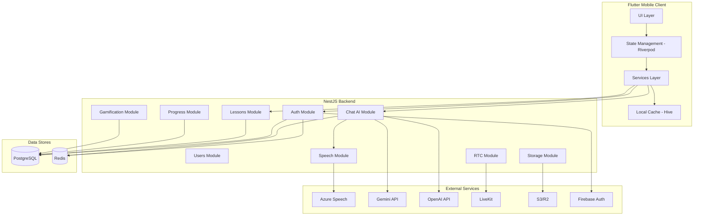

# FluentFly Design Document

## Overview

FluentFly is a full-stack AI-powered English learning platform consisting of a Flutter mobile client, NestJS backend API, PostgreSQL database, and integrations with Azure Speech Services, Gemini/OpenAI LLMs, and LiveKit for real-time communication. The system follows a microservices-inspired modular architecture with clear separation of concerns.

### Design Principles

1. **Modularity**: Clear separation between frontend, backend, and external services
2. **Resilience**: Graceful degradation with fallbacks for all external dependencies
3. **Performance**: Aggressive caching, lazy loading, and optimized asset delivery
4. **Security**: JWT-based authentication, input validation, and encrypted data storage
5. **Scalability**: Stateless API design enabling horizontal scaling
6. **User Experience**: Smooth animations, offline support, and instant feedback

### System Context

```
┌─────────────┐
│   User      │
└──────┬──────┘
       │
┌──────▼──────────────────────────────────────────┐
│         Flutter Mobile Client                   │
│  (iOS/Android - Dart 3 Null-Safe)              │
└──────┬──────────────────────────────────────────┘
       │ HTTPS/REST
┌──────▼──────────────────────────────────────────┐
│         NestJS Backend API                      │
│  (Node.js 20 + TypeScript 5)                   │
└──┬───┬───┬───┬───┬───┬──────────────────────────┘
   │   │   │   │   │   │
   │   │   │   │   │   └─► LiveKit (RTC)
   │   │   │   │   └─────► S3/R2 (Storage)
   │   │   │   └─────────► Redis (Cache)
   │   │   └─────────────► Azure Speech (TTS/STT)
   │   └─────────────────► Gemini/OpenAI (LLM)
   └─────────────────────► PostgreSQL (Database)
```

## Architecture

### High-Level Architecture


The system follows a three-tier architecture:

**Presentation Layer (Flutter Mobile Client)**
- Handles UI rendering, user interactions, and local state management
- Implements offline-first data strategy with Hive/Sqflite
- Manages audio recording/playback and Lottie animations
- Communicates with backend via REST API

**Application Layer (NestJS Backend)**
- Implements business logic and orchestrates external services
- Provides RESTful API endpoints with Swagger documentation
- Handles authentication, authorization, and session management
- Coordinates AI chat pipeline and feedback generation

**Data Layer**
- PostgreSQL for persistent relational data
- Redis for session caching and rate limiting
- S3/R2 for audio file and asset storage
- Local device storage for offline caching

### Component Architecture




## Components and Interfaces

### Flutter Mobile Client

#### Directory Structure

```
lib/
├── main.dart                    # App entry point, theme setup
├── app.dart                     # Root widget with navigation
├── config/
│   ├── theme.dart              # Theme configuration (colors, fonts)
│   ├── constants.dart          # App constants (API URLs, keys)
│   └── routes.dart             # Named routes
├── models/
│   ├── user.dart               # User model
│   ├── lesson.dart             # Lesson model
│   ├── exercise.dart           # Exercise model
│   ├── progress.dart           # Progress model
│   ├── chat_message.dart       # Chat message model
│   └── feedback.dart           # Feedback model
├── providers/
│   ├── auth_provider.dart      # Authentication state
│   ├── lesson_provider.dart    # Lesson data state
│   ├── progress_provider.dart  # Progress tracking state
│   └── theme_provider.dart     # Theme state
├── services/
│   ├── api_service.dart        # HTTP client wrapper
│   ├── auth_service.dart       # Authentication logic
│   ├── audio_service.dart      # Audio recording/playback
│   ├── cache_service.dart      # Local caching with Hive
│   ├── ai_service.dart         # AI chat integration
│   └── analytics_service.dart  # Analytics tracking
├── screens/
│   ├── splash_screen.dart      # App splash with animation
│   ├── auth/
│   │   ├── login_screen.dart
│   │   └── otp_screen.dart
│   ├── home_screen.dart        # Lesson path overview
│   ├── lesson/
│   │   ├── lesson_overview_screen.dart
│   │   ├── vocabulary_screen.dart
│   │   ├── listening_screen.dart
│   │   ├── speaking_screen.dart
│   │   ├── quiz_screen.dart
│   │   └── feedback_screen.dart
│   ├── speak_screen.dart       # AI avatar conversation
│   ├── review_screen.dart      # Mistakes review
│   ├── progress_screen.dart    # XP, streaks, badges
│   └── profile_screen.dart     # User settings
├── widgets/
│   ├── lesson_card.dart        # Lesson card component
│   ├── avatar_widget.dart      # Animated avatar
│   ├── feedback_card.dart      # Feedback display
│   ├── mic_button.dart         # Recording button
│   ├── xp_bar.dart            # XP progress bar
│   ├── streak_indicator.dart   # Streak display
│   └── badge_widget.dart       # Badge display
└── utils/
    ├── validators.dart         # Input validators
    ├── formatters.dart         # Data formatters
    └── error_handler.dart      # Error handling utilities

assets/
├── lottie/
│   ├── app_intro_plane.json
│   ├── ai_tutor_talking.json
│   ├── success_confetti.json
│   ├── blue_wave_loader.json
│   ├── flying_xp_coins.json
│   ├── audio_wave_mic.json
│   ├── happy_feedback_star.json
│   ├── sad_robot_retry.json
│   ├── floating_shapes_bg.json
│   ├── progress_trophy.json
│   └── fallback_pulse.json
├── images/
│   └── logo.png
└── audio/
    └── placeholder.mp3
```

#### Key Components

**1. API Service**
- Singleton HTTP client using Dio package
- Automatic JWT token injection via interceptors
- Request/response logging
- Error handling with retry logic
- Timeout configuration (30s for normal, 60s for AI)

```dart
class ApiService {
  final Dio _dio;
  
  Future<Response> get(String path);
  Future<Response> post(String path, dynamic data);
  Future<Response> put(String path, dynamic data);
  Future<Response> delete(String path);
  Future<Response> uploadFile(String path, File file);
}
```

**2. Audio Service**
- Record audio using flutter_sound package
- Playback with audio_players package
- Format: AAC for recording, MP3 for playback
- Automatic permission handling
- Waveform visualization data

```dart
class AudioService {
  Future<void> startRecording();
  Future<String> stopRecording(); // Returns file path
  Future<void> playAudio(String url);
  Future<void> stopAudio();
  Stream<RecordingDisposition> get recordingStream;
}
```

**3. Cache Service**
- Hive for structured data (lessons, progress)
- Sqflite for complex queries
- Cache invalidation strategy (7 days TTL)
- Automatic sync on network restore

```dart
class CacheService {
  Future<void> cacheLesson(Lesson lesson);
  Future<Lesson?> getCachedLesson(int id);
  Future<void> cacheAudio(String url, Uint8List data);
  Future<Uint8List?> getCachedAudio(String url);
  Future<void> clearExpiredCache();
}
```


**4. State Management with Riverpod**

```dart
// Auth Provider
final authProvider = StateNotifierProvider<AuthNotifier, AuthState>((ref) {
  return AuthNotifier(ref.read(authServiceProvider));
});

// Lesson Provider
final lessonProvider = FutureProvider.family<Lesson, int>((ref, id) async {
  return ref.read(apiServiceProvider).getLesson(id);
});

// Progress Provider
final progressProvider = StateNotifierProvider<ProgressNotifier, ProgressState>((ref) {
  return ProgressNotifier(ref.read(apiServiceProvider));
});
```

**5. Navigation Structure**

Bottom navigation with 5 tabs:
- Home (index 0): Lesson path with Duolingo-style tree
- Speak (index 1): AI avatar conversation interface
- Review (index 2): Mistakes and vocabulary review
- Progress (index 3): XP, streaks, leaderboard, badges
- Profile (index 4): Settings, theme, language preferences

### NestJS Backend

#### Directory Structure

```
src/
├── main.ts                      # Bootstrap application
├── app.module.ts                # Root module
├── config/
│   ├── database.config.ts      # TypeORM configuration
│   ├── redis.config.ts         # Redis configuration
│   └── swagger.config.ts       # Swagger setup
├── common/
│   ├── decorators/
│   │   ├── current-user.decorator.ts
│   │   └── public.decorator.ts
│   ├── filters/
│   │   └── http-exception.filter.ts
│   ├── guards/
│   │   ├── jwt-auth.guard.ts
│   │   └── rate-limit.guard.ts
│   ├── interceptors/
│   │   ├── logging.interceptor.ts
│   │   └── transform.interceptor.ts
│   └── pipes/
│       └── validation.pipe.ts
├── modules/
│   ├── auth/
│   │   ├── auth.module.ts
│   │   ├── auth.controller.ts
│   │   ├── auth.service.ts
│   │   ├── strategies/
│   │   │   ├── jwt.strategy.ts
│   │   │   └── google.strategy.ts
│   │   └── dto/
│   │       ├── login.dto.ts
│   │       └── register.dto.ts
│   ├── users/
│   │   ├── users.module.ts
│   │   ├── users.controller.ts
│   │   ├── users.service.ts
│   │   ├── entities/
│   │   │   └── user.entity.ts
│   │   └── dto/
│   │       └── update-user.dto.ts
│   ├── lessons/
│   │   ├── lessons.module.ts
│   │   ├── lessons.controller.ts
│   │   ├── lessons.service.ts
│   │   ├── entities/
│   │   │   ├── lesson.entity.ts
│   │   │   └── exercise.entity.ts
│   │   └── dto/
│   │       ├── create-lesson.dto.ts
│   │       └── lesson-response.dto.ts
│   ├── progress/
│   │   ├── progress.module.ts
│   │   ├── progress.controller.ts
│   │   ├── progress.service.ts
│   │   ├── entities/
│   │   │   └── progress.entity.ts
│   │   └── dto/
│   │       └── update-progress.dto.ts
│   ├── gamification/
│   │   ├── gamification.module.ts
│   │   ├── gamification.controller.ts
│   │   ├── gamification.service.ts
│   │   ├── entities/
│   │   │   └── badge.entity.ts
│   │   └── dto/
│   │       └── leaderboard-response.dto.ts
│   ├── chat-ai/
│   │   ├── chat-ai.module.ts
│   │   ├── chat-ai.controller.ts
│   │   ├── chat-ai.service.ts
│   │   ├── providers/
│   │   │   ├── gemini.provider.ts
│   │   │   └── openai.provider.ts
│   │   ├── entities/
│   │   │   └── chat-session.entity.ts
│   │   └── dto/
│   │       ├── chat-turn.dto.ts
│   │       └── feedback-request.dto.ts
│   ├── speech/
│   │   ├── speech.module.ts
│   │   ├── speech.controller.ts
│   │   ├── speech.service.ts
│   │   └── dto/
│   │       ├── tts-request.dto.ts
│   │       └── stt-request.dto.ts
│   ├── rtc/
│   │   ├── rtc.module.ts
│   │   ├── rtc.controller.ts
│   │   └── rtc.service.ts
│   └── storage/
│       ├── storage.module.ts
│       ├── storage.controller.ts
│       └── storage.service.ts
└── database/
    ├── migrations/
    └── seeds/
        └── lessons.seed.ts

test/
├── unit/
└── integration/
```


#### Key Backend Modules

**1. Auth Module**

Handles authentication and authorization:
- Google OAuth integration via Passport
- Phone OTP via Firebase Admin SDK
- JWT token generation and validation
- Refresh token mechanism

```typescript
@Controller('auth')
export class AuthController {
  @Post('google')
  async googleAuth(@Body() dto: GoogleAuthDto): Promise<AuthResponse>;
  
  @Post('phone/send-otp')
  async sendOtp(@Body() dto: PhoneDto): Promise<{ success: boolean }>;
  
  @Post('phone/verify-otp')
  async verifyOtp(@Body() dto: VerifyOtpDto): Promise<AuthResponse>;
  
  @Post('refresh')
  async refreshToken(@Body() dto: RefreshTokenDto): Promise<AuthResponse>;
}
```

**2. Lessons Module**

Manages lesson content and exercises:
- CRUD operations for lessons
- Exercise retrieval by lesson ID
- Skill level filtering
- Metadata management (audio URLs, difficulty)

```typescript
@Controller('lessons')
export class LessonsController {
  @Get()
  async findAll(@Query() query: LessonQueryDto): Promise<Lesson[]>;
  
  @Get(':id')
  async findOne(@Param('id') id: number): Promise<Lesson>;
  
  @Get(':id/exercises')
  async getExercises(@Param('id') id: number): Promise<Exercise[]>;
}
```

**3. Chat AI Module**

Orchestrates the AI conversation pipeline:
- Dual LLM provider (Gemini primary, OpenAI fallback)
- System prompt management
- Conversation context tracking
- Response formatting

```typescript
@Controller('chat')
export class ChatAiController {
  @Post('turn')
  async processTurn(@Body() dto: ChatTurnDto, @CurrentUser() user: User): Promise<ChatResponse>;
  
  @Post('feedback')
  async generateFeedback(@Body() dto: FeedbackRequestDto): Promise<FeedbackResponse>;
  
  @Get('sessions')
  async getSessions(@CurrentUser() user: User): Promise<ChatSession[]>;
}
```

**Chat AI Service Logic:**

```typescript
export class ChatAiService {
  async processTurn(userText: string, userId: number): Promise<ChatResponse> {
    // 1. Get conversation context from Redis
    const context = await this.getContext(userId);
    
    // 2. Try Gemini first
    let aiResponse;
    try {
      aiResponse = await this.geminiProvider.generate(userText, context);
    } catch (error) {
      // 3. Fallback to OpenAI
      aiResponse = await this.openaiProvider.generate(userText, context);
    }
    
    // 4. Generate TTS audio
    const ttsUrl = await this.speechService.textToSpeech(aiResponse.reply);
    
    // 5. Update context in Redis
    await this.updateContext(userId, userText, aiResponse.reply);
    
    // 6. Return response
    return {
      reply: aiResponse.reply,
      emotion: aiResponse.emotion,
      hint: aiResponse.hint,
      ttsUrl,
    };
  }
}
```

**4. Speech Module**

Integrates Azure Cognitive Services:
- Text-to-Speech with caching
- Speech-to-Text with confidence scores
- Audio format conversion
- S3 storage for generated audio

```typescript
@Controller('speech')
export class SpeechController {
  @Post('tts')
  async textToSpeech(@Body() dto: TtsRequestDto): Promise<{ audioUrl: string }>;
  
  @Post('stt')
  @UseInterceptors(FileInterceptor('audio'))
  async speechToText(@UploadedFile() file: Express.Multer.File): Promise<SttResponse>;
}
```

**Speech Service Implementation:**

```typescript
export class SpeechService {
  async textToSpeech(text: string): Promise<string> {
    // 1. Generate hash for caching
    const hash = this.generateHash(text, 'en-US-JennyNeural');
    
    // 2. Check cache
    const cached = await this.storageService.getAudio(hash);
    if (cached) return cached;
    
    // 3. Call Azure TTS
    const audioBuffer = await this.azureTts(text, {
      voice: 'en-US-JennyNeural',
      style: 'cheerful',
      format: 'audio-24khz-48kbitrate-mono-mp3',
    });
    
    // 4. Upload to S3
    const url = await this.storageService.uploadAudio(hash, audioBuffer);
    
    return url;
  }
  
  async speechToText(audioBuffer: Buffer): Promise<SttResponse> {
    // Call Azure STT with real-time mode
    const result = await this.azureStt(audioBuffer, {
      language: 'en-US',
      profanityOption: 'Masked',
      wordLevelTimestamps: true,
    });
    
    return {
      text: result.text,
      confidence: result.confidence,
      words: result.words.map(w => ({
        word: w.word,
        confidence: w.confidence,
        offset: w.offset,
        duration: w.duration,
      })),
    };
  }
}
```


**5. Gamification Module**

Manages XP, streaks, badges, and leaderboard:
- XP calculation and awarding
- Streak tracking with daily reset
- Badge unlocking logic
- Leaderboard ranking

```typescript
@Controller('gamification')
export class GamificationController {
  @Post('award-xp')
  async awardXp(@Body() dto: AwardXpDto, @CurrentUser() user: User): Promise<XpResponse>;
  
  @Get('leaderboard')
  async getLeaderboard(@Query() query: LeaderboardQueryDto): Promise<LeaderboardEntry[]>;
  
  @Get('badges')
  async getBadges(@CurrentUser() user: User): Promise<Badge[]>;
  
  @Post('check-streak')
  async checkStreak(@CurrentUser() user: User): Promise<StreakResponse>;
}
```

**XP Award Logic:**

```typescript
export class GamificationService {
  async awardXp(userId: number, amount: number, reason: string): Promise<XpResponse> {
    const user = await this.usersService.findOne(userId);
    
    // Calculate bonus XP
    let bonusXp = 0;
    if (user.streak > 0) {
      bonusXp = user.streak * 5; // 5 XP per streak day
    }
    
    const totalXp = amount + bonusXp;
    
    // Update user XP
    user.xp += totalXp;
    
    // Check for level up
    const newLevel = this.calculateLevel(user.xp);
    const leveledUp = newLevel !== user.level;
    
    if (leveledUp) {
      user.level = newLevel;
    }
    
    await this.usersService.save(user);
    
    // Check for new badges
    const newBadges = await this.checkBadges(user);
    
    return {
      xpAwarded: totalXp,
      totalXp: user.xp,
      leveledUp,
      newLevel: user.level,
      newBadges,
    };
  }
}
```

**6. Progress Module**

Tracks user learning progress:
- Lesson completion status
- Exercise scores
- Time spent per lesson
- Historical progress data

```typescript
@Controller('progress')
export class ProgressController {
  @Post()
  async saveProgress(@Body() dto: SaveProgressDto, @CurrentUser() user: User): Promise<Progress>;
  
  @Get()
  async getProgress(@CurrentUser() user: User): Promise<Progress[]>;
  
  @Get('stats')
  async getStats(@CurrentUser() user: User): Promise<ProgressStats>;
}
```

## Data Models

### Database Schema (PostgreSQL)

```sql
-- Users table
CREATE TABLE users (
  id SERIAL PRIMARY KEY,
  email VARCHAR(255) UNIQUE,
  phone VARCHAR(20) UNIQUE,
  name VARCHAR(255) NOT NULL,
  xp INTEGER DEFAULT 0,
  streak INTEGER DEFAULT 0,
  level VARCHAR(10) DEFAULT 'A1',
  last_active_date DATE,
  profile_image_url TEXT,
  created_at TIMESTAMP DEFAULT CURRENT_TIMESTAMP,
  updated_at TIMESTAMP DEFAULT CURRENT_TIMESTAMP
);

-- Lessons table
CREATE TABLE lessons (
  id SERIAL PRIMARY KEY,
  skill VARCHAR(50) NOT NULL,
  title VARCHAR(255) NOT NULL,
  level VARCHAR(10) NOT NULL,
  audio_url TEXT,
  description TEXT,
  meta JSONB,
  order_index INTEGER,
  created_at TIMESTAMP DEFAULT CURRENT_TIMESTAMP,
  updated_at TIMESTAMP DEFAULT CURRENT_TIMESTAMP
);

-- Exercises table
CREATE TABLE exercises (
  id SERIAL PRIMARY KEY,
  lesson_id INTEGER REFERENCES lessons(id) ON DELETE CASCADE,
  type VARCHAR(50) NOT NULL, -- 'mcq', 'fill_blank', 'speaking', 'listening'
  question TEXT NOT NULL,
  options JSONB, -- Array of options for MCQ
  answer JSONB, -- Correct answer(s)
  audio_url TEXT,
  order_index INTEGER,
  created_at TIMESTAMP DEFAULT CURRENT_TIMESTAMP
);

-- Progress table
CREATE TABLE progress (
  id SERIAL PRIMARY KEY,
  user_id INTEGER REFERENCES users(id) ON DELETE CASCADE,
  lesson_id INTEGER REFERENCES lessons(id) ON DELETE CASCADE,
  score JSONB, -- { correct: 8, total: 10, percentage: 80 }
  completed BOOLEAN DEFAULT FALSE,
  time_spent INTEGER, -- seconds
  completed_at TIMESTAMP,
  created_at TIMESTAMP DEFAULT CURRENT_TIMESTAMP,
  UNIQUE(user_id, lesson_id)
);

-- Chat sessions table
CREATE TABLE chat_sessions (
  id SERIAL PRIMARY KEY,
  user_id INTEGER REFERENCES users(id) ON DELETE CASCADE,
  topic VARCHAR(255),
  transcript JSONB, -- Array of { role, text, timestamp }
  feedback JSONB, -- { fluency, pronunciation, grammar, tips }
  duration INTEGER, -- seconds
  created_at TIMESTAMP DEFAULT CURRENT_TIMESTAMP
);

-- Badges table
CREATE TABLE badges (
  id SERIAL PRIMARY KEY,
  name VARCHAR(100) NOT NULL UNIQUE,
  description TEXT,
  icon_url TEXT,
  criteria JSONB, -- { type: 'streak', value: 7 }
  created_at TIMESTAMP DEFAULT CURRENT_TIMESTAMP
);

-- User badges junction table
CREATE TABLE user_badges (
  id SERIAL PRIMARY KEY,
  user_id INTEGER REFERENCES users(id) ON DELETE CASCADE,
  badge_id INTEGER REFERENCES badges(id) ON DELETE CASCADE,
  earned_at TIMESTAMP DEFAULT CURRENT_TIMESTAMP,
  UNIQUE(user_id, badge_id)
);

-- Indexes for performance
CREATE INDEX idx_lessons_level ON lessons(level);
CREATE INDEX idx_progress_user_id ON progress(user_id);
CREATE INDEX idx_chat_sessions_user_id ON chat_sessions(user_id);
CREATE INDEX idx_users_xp ON users(xp DESC);
```


### TypeScript/Dart Models

**User Model (Dart)**

```dart
class User {
  final int id;
  final String? email;
  final String? phone;
  final String name;
  final int xp;
  final int streak;
  final String level;
  final DateTime? lastActiveDate;
  final String? profileImageUrl;
  
  User({
    required this.id,
    this.email,
    this.phone,
    required this.name,
    required this.xp,
    required this.streak,
    required this.level,
    this.lastActiveDate,
    this.profileImageUrl,
  });
  
  factory User.fromJson(Map<String, dynamic> json) {
    return User(
      id: json['id'],
      email: json['email'],
      phone: json['phone'],
      name: json['name'],
      xp: json['xp'],
      streak: json['streak'],
      level: json['level'],
      lastActiveDate: json['lastActiveDate'] != null 
        ? DateTime.parse(json['lastActiveDate']) 
        : null,
      profileImageUrl: json['profileImageUrl'],
    );
  }
}
```

**Lesson Model (Dart)**

```dart
class Lesson {
  final int id;
  final String skill;
  final String title;
  final String level;
  final String? audioUrl;
  final String? description;
  final Map<String, dynamic>? meta;
  final List<Exercise> exercises;
  
  Lesson({
    required this.id,
    required this.skill,
    required this.title,
    required this.level,
    this.audioUrl,
    this.description,
    this.meta,
    this.exercises = const [],
  });
  
  factory Lesson.fromJson(Map<String, dynamic> json) {
    return Lesson(
      id: json['id'],
      skill: json['skill'],
      title: json['title'],
      level: json['level'],
      audioUrl: json['audioUrl'],
      description: json['description'],
      meta: json['meta'],
      exercises: (json['exercises'] as List?)
        ?.map((e) => Exercise.fromJson(e))
        .toList() ?? [],
    );
  }
}
```

**Chat Response Model (TypeScript)**

```typescript
export interface ChatResponse {
  reply: string;
  emotion: 'happy' | 'neutral' | 'encouraging';
  hint?: string;
  ttsUrl: string;
}

export interface FeedbackResponse {
  fluency: number; // 0-100
  pronunciation: number; // 0-100
  grammar: number; // 0-100
  tips: string[];
  detailedAnalysis?: {
    wordsPerMinute: number;
    pauseCount: number;
    lowConfidenceWords: string[];
    grammarErrors: Array<{
      text: string;
      correction: string;
      explanation: string;
    }>;
  };
}
```

## External Service Integrations

### Azure Speech Services

**Configuration:**
- Region: eastus (or configurable via env)
- Subscription key: from environment variable
- TTS Voice: en-US-JennyNeural
- TTS Style: cheerful
- Output format: audio-24khz-48kbitrate-mono-mp3
- STT Language: en-US
- STT Mode: Real-time

**Implementation Pattern:**

```typescript
import * as sdk from 'microsoft-cognitiveservices-speech-sdk';

export class AzureSpeechProvider {
  private speechConfig: sdk.SpeechConfig;
  
  constructor() {
    this.speechConfig = sdk.SpeechConfig.fromSubscription(
      process.env.AZURE_SPEECH_KEY,
      process.env.AZURE_SPEECH_REGION
    );
  }
  
  async synthesizeSpeech(text: string): Promise<Buffer> {
    const synthesizer = new sdk.SpeechSynthesizer(this.speechConfig);
    
    const ssml = `
      <speak version="1.0" xmlns="http://www.w3.org/2001/10/synthesis" xml:lang="en-US">
        <voice name="en-US-JennyNeural">
          <mstts:express-as style="cheerful">
            ${text}
          </mstts:express-as>
        </voice>
      </speak>
    `;
    
    return new Promise((resolve, reject) => {
      synthesizer.speakSsmlAsync(
        ssml,
        result => {
          if (result.reason === sdk.ResultReason.SynthesizingAudioCompleted) {
            resolve(Buffer.from(result.audioData));
          } else {
            reject(new Error('Speech synthesis failed'));
          }
          synthesizer.close();
        },
        error => {
          synthesizer.close();
          reject(error);
        }
      );
    });
  }
  
  async recognizeSpeech(audioBuffer: Buffer): Promise<SttResult> {
    const audioConfig = sdk.AudioConfig.fromWavFileInput(audioBuffer);
    const recognizer = new sdk.SpeechRecognizer(this.speechConfig, audioConfig);
    
    return new Promise((resolve, reject) => {
      recognizer.recognizeOnceAsync(
        result => {
          if (result.reason === sdk.ResultReason.RecognizedSpeech) {
            resolve({
              text: result.text,
              confidence: result.properties.getProperty(
                sdk.PropertyId.SpeechServiceResponse_JsonResult
              ),
            });
          } else {
            reject(new Error('Speech recognition failed'));
          }
          recognizer.close();
        },
        error => {
          recognizer.close();
          reject(error);
        }
      );
    });
  }
}
```


### Gemini API Integration

**Configuration:**
- Model: gemini-1.5-flash
- API Key: from environment variable
- Temperature: 0.7 (balanced creativity)
- Max tokens: 150 (short responses)
- Response format: JSON

**Implementation:**

```typescript
import { GoogleGenerativeAI } from '@google/generative-ai';

export class GeminiProvider {
  private genAI: GoogleGenerativeAI;
  private model: any;
  
  constructor() {
    this.genAI = new GoogleGenerativeAI(process.env.GEMINI_API_KEY);
    this.model = this.genAI.getGenerativeModel({ model: 'gemini-1.5-flash' });
  }
  
  async generate(userText: string, context: string[]): Promise<AiResponse> {
    const systemPrompt = `You are FluentFly, an empathetic English tutor for Hindi speakers.
Encourage learners, correct grammar gently, and reply in ≤2 sentences.
Return ONLY valid JSON in this format: {"reply":"...","emotion":"happy|neutral|encouraging","hint":"..."}`;
    
    const conversationHistory = context.join('\n');
    const prompt = `${systemPrompt}\n\nConversation:\n${conversationHistory}\n\nUser: ${userText}\n\nAssistant:`;
    
    try {
      const result = await this.model.generateContent(prompt);
      const response = await result.response;
      const text = response.text();
      
      // Parse JSON response
      const parsed = JSON.parse(text);
      
      return {
        reply: parsed.reply,
        emotion: parsed.emotion || 'neutral',
        hint: parsed.hint,
      };
    } catch (error) {
      throw new Error(`Gemini API error: ${error.message}`);
    }
  }
}
```

### OpenAI API Integration (Fallback)

**Configuration:**
- Model: gpt-4o-mini
- API Key: from environment variable
- Temperature: 0.7
- Max tokens: 150
- Response format: JSON mode

**Implementation:**

```typescript
import OpenAI from 'openai';

export class OpenAiProvider {
  private client: OpenAI;
  
  constructor() {
    this.client = new OpenAI({
      apiKey: process.env.OPENAI_API_KEY,
    });
  }
  
  async generate(userText: string, context: string[]): Promise<AiResponse> {
    const systemPrompt = `You are FluentFly, an empathetic English tutor for Hindi speakers.
Encourage learners, correct grammar gently, and reply in ≤2 sentences.
Return ONLY valid JSON in this format: {"reply":"...","emotion":"happy|neutral|encouraging","hint":"..."}`;
    
    const messages = [
      { role: 'system', content: systemPrompt },
      ...context.map((msg, i) => ({
        role: i % 2 === 0 ? 'user' : 'assistant',
        content: msg,
      })),
      { role: 'user', content: userText },
    ];
    
    try {
      const completion = await this.client.chat.completions.create({
        model: 'gpt-4o-mini',
        messages,
        temperature: 0.7,
        max_tokens: 150,
        response_format: { type: 'json_object' },
      });
      
      const content = completion.choices[0].message.content;
      const parsed = JSON.parse(content);
      
      return {
        reply: parsed.reply,
        emotion: parsed.emotion || 'neutral',
        hint: parsed.hint,
      };
    } catch (error) {
      throw new Error(`OpenAI API error: ${error.message}`);
    }
  }
}
```

### LiveKit Integration

**Purpose:** Real-time video/audio for avatar conversations

**Configuration:**
- API Key and Secret from environment
- Room creation for each conversation session
- Token generation with user identity

**Implementation:**

```typescript
import { AccessToken } from 'livekit-server-sdk';

export class RtcService {
  async createToken(userId: number, roomName: string): Promise<string> {
    const at = new AccessToken(
      process.env.LIVEKIT_API_KEY,
      process.env.LIVEKIT_API_SECRET,
      {
        identity: `user_${userId}`,
        ttl: '1h',
      }
    );
    
    at.addGrant({
      roomJoin: true,
      room: roomName,
      canPublish: true,
      canSubscribe: true,
    });
    
    return at.toJwt();
  }
}
```

### S3/Cloudflare R2 Storage

**Purpose:** Store generated TTS audio files and user recordings

**Configuration:**
- Bucket name: fluentfly-audio
- Region: auto (for R2) or us-east-1 (for S3)
- Access key and secret from environment
- Public read access for TTS files

**Implementation:**

```typescript
import { S3Client, PutObjectCommand, GetObjectCommand } from '@aws-sdk/client-s3';
import { getSignedUrl } from '@aws-sdk/s3-request-presigner';

export class StorageService {
  private s3Client: S3Client;
  private bucketName: string;
  
  constructor() {
    this.s3Client = new S3Client({
      region: process.env.S3_REGION,
      credentials: {
        accessKeyId: process.env.S3_ACCESS_KEY,
        secretAccessKey: process.env.S3_SECRET_KEY,
      },
      endpoint: process.env.S3_ENDPOINT, // For R2
    });
    this.bucketName = process.env.S3_BUCKET_NAME;
  }
  
  async uploadAudio(key: string, buffer: Buffer): Promise<string> {
    const command = new PutObjectCommand({
      Bucket: this.bucketName,
      Key: `audio/${key}.mp3`,
      Body: buffer,
      ContentType: 'audio/mpeg',
      CacheControl: 'max-age=31536000', // 1 year
    });
    
    await this.s3Client.send(command);
    
    // Return public URL or signed URL
    return `${process.env.CDN_URL}/audio/${key}.mp3`;
  }
  
  async getAudio(key: string): Promise<string | null> {
    try {
      const command = new GetObjectCommand({
        Bucket: this.bucketName,
        Key: `audio/${key}.mp3`,
      });
      
      // Check if exists
      await this.s3Client.send(command);
      return `${process.env.CDN_URL}/audio/${key}.mp3`;
    } catch (error) {
      return null;
    }
  }
}
```

